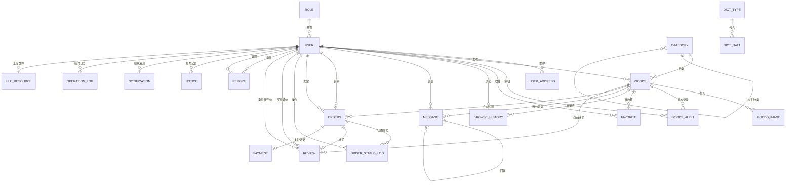
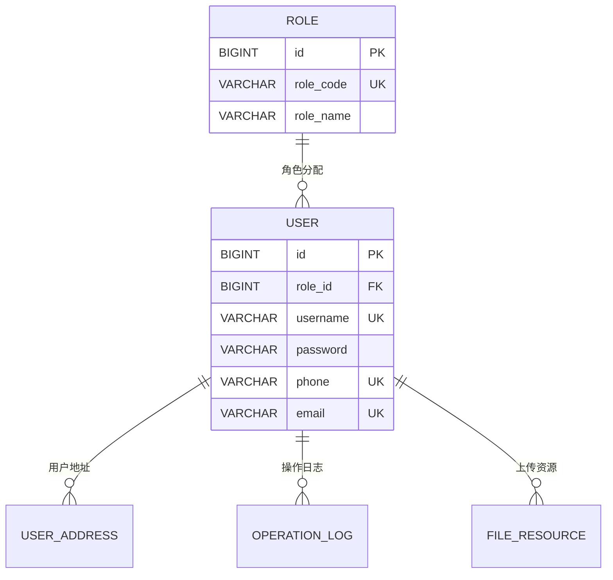
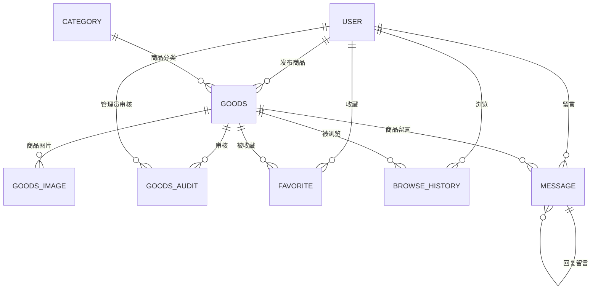
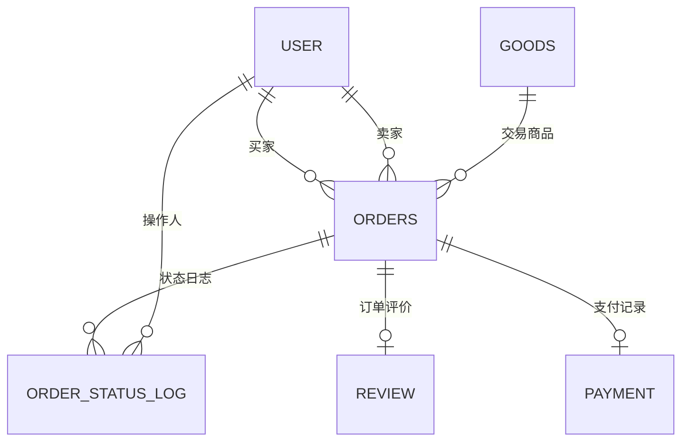
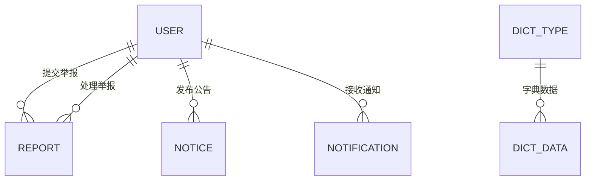

# 数据库设计（E-R 图与数据表结构）

## 1. 数据库设计概述

本系统数据库名称为 `Deal_Platform`，采用 MySQL 数据库进行设计，字符集使用 `utf8mb4`，能够支持中文、英文和常见特殊字符存储。数据库围绕校园二手交易业务展开，核心业务包括用户注册登录、商品发布与审核、商品浏览与收藏、留言咨询、订单交易、交易评价、举报处理、系统公告、站内消息、操作日志、轮播图展示等。

系统数据库设计以用户、商品、订单为核心。其中，用户通过角色表区分管理员和普通用户；普通用户可以发布商品、收藏商品、浏览商品、留言咨询、创建订单和评价订单；管理员可以审核商品、处理举报、发布公告、维护分类、查看日志和统计数据。

数据库设计中使用主键、外键、唯一约束、检查约束和索引保证数据完整性与查询效率。涉及历史业务的数据，例如商品、留言等，采用逻辑删除字段，便于保留交易记录和后续追溯。

## 2. E-R 图设计

### 2.1 系统总 E-R 图

### 2.2 用户与权限模块 E-R 图

### 2.3 商品与互动模块 E-R 图

### 2.4 订单与交易模块 E-R 图

### 2.5 平台管理模块 E-R 图

## 3. 数据表结构设计

### 3.1 角色表 `role`

角色表用于保存系统角色信息，例如管理员和普通用户。

| 字段名 | 数据类型 | 约束 | 说明 |
|---|---|---|---|
| id | BIGINT | 主键，自增 | 角色ID |
| role_code | VARCHAR(30) | 非空，唯一 | 角色编码：admin/user |
| role_name | VARCHAR(50) | 非空 | 角色名称 |
| description | VARCHAR(255) | 可空 | 角色说明 |
| create_time | DATETIME | 非空，默认当前时间 | 创建时间 |

### 3.2 用户表 `user`

用户表用于保存平台注册用户和管理员账号信息。

| 字段名 | 数据类型 | 约束 | 说明 |
|---|---|---|---|
| id | BIGINT | 主键，自增 | 用户ID |
| role_id | BIGINT | 非空，外键 | 角色ID，关联 `role(id)` |
| username | VARCHAR(50) | 非空，唯一 | 用户名 |
| password | VARCHAR(100) | 非空 | 登录密码 |
| real_name | VARCHAR(50) | 可空 | 真实姓名 |
| nickname | VARCHAR(50) | 可空 | 昵称 |
| student_no | VARCHAR(30) | 可空，唯一 | 学号 |
| phone | VARCHAR(20) | 可空，唯一 | 手机号 |
| email | VARCHAR(100) | 可空，唯一 | 邮箱 |
| avatar_url | VARCHAR(255) | 可空 | 头像路径 |
| gender | TINYINT | 默认 0 | 性别：0未知，1男，2女 |
| status | TINYINT | 非空，默认 1 | 状态：0禁用，1正常 |
| last_login_time | DATETIME | 可空 | 最后登录时间 |
| create_time | DATETIME | 非空，默认当前时间 | 创建时间 |
| update_time | DATETIME | 非空，自动更新 | 更新时间 |
| is_deleted | TINYINT | 非空，默认 0 | 逻辑删除：0未删除，1已删除 |

### 3.3 用户地址表 `user_address`

用户地址表用于保存用户常用交易地点。

| 字段名 | 数据类型 | 约束 | 说明 |
|---|---|---|---|
| id | BIGINT | 主键，自增 | 地址ID |
| user_id | BIGINT | 非空，外键 | 用户ID，关联 `user(id)` |
| contact_name | VARCHAR(50) | 非空 | 联系人 |
| contact_phone | VARCHAR(20) | 非空 | 联系电话 |
| campus_area | VARCHAR(100) | 非空 | 校区或区域 |
| detail_address | VARCHAR(255) | 非空 | 详细交易地点 |
| is_default | TINYINT | 非空，默认 0 | 是否默认地址：0否，1是 |
| create_time | DATETIME | 非空，默认当前时间 | 创建时间 |
| update_time | DATETIME | 非空，自动更新 | 更新时间 |

### 3.4 商品分类表 `category`

商品分类表用于维护商品分类，支持父子分类结构。

| 字段名 | 数据类型 | 约束 | 说明 |
|---|---|---|---|
| id | BIGINT | 主键，自增 | 分类ID |
| parent_id | BIGINT | 可空，外键 | 父级分类ID，关联 `category(id)` |
| category_name | VARCHAR(50) | 非空 | 分类名称 |
| sort_order | INT | 非空，默认 0 | 排序值 |
| status | TINYINT | 非空，默认 1 | 状态：0禁用，1启用 |
| create_time | DATETIME | 非空，默认当前时间 | 创建时间 |
| update_time | DATETIME | 非空，自动更新 | 更新时间 |

唯一约束：`uk_category_name_parent(category_name, parent_id)`，避免同一父分类下出现重复分类名。

### 3.5 商品表 `goods`

商品表用于保存用户发布的二手商品信息，是系统核心业务表之一。

| 字段名 | 数据类型 | 约束 | 说明 |
|---|---|---|---|
| id | BIGINT | 主键，自增 | 商品ID |
| seller_id | BIGINT | 非空，外键 | 卖家用户ID，关联 `user(id)` |
| category_id | BIGINT | 非空，外键 | 分类ID，关联 `category(id)` |
| title | VARCHAR(100) | 非空 | 商品标题 |
| description | TEXT | 非空 | 商品描述 |
| price | DECIMAL(10,2) | 非空，检查 >= 0 | 商品价格 |
| original_price | DECIMAL(10,2) | 可空，检查 >= 0 | 原价 |
| condition_level | TINYINT | 非空，默认 3 | 成色：1较旧，2一般，3良好，4很新，5全新 |
| trade_place | VARCHAR(255) | 可空 | 交易地点 |
| cover_image_url | VARCHAR(255) | 可空 | 封面图片 |
| status | TINYINT | 非空，默认 0 | 商品状态：0待审核，1已上架，2已下架，3已售出，4审核失败 |
| audit_remark | VARCHAR(255) | 可空 | 审核备注 |
| view_count | INT | 非空，默认 0 | 浏览次数 |
| favorite_count | INT | 非空，默认 0 | 收藏次数 |
| publish_time | DATETIME | 非空，默认当前时间 | 发布时间 |
| create_time | DATETIME | 非空，默认当前时间 | 创建时间 |
| update_time | DATETIME | 非空，自动更新 | 更新时间 |
| is_deleted | TINYINT | 非空，默认 0 | 逻辑删除：0未删除，1已删除 |

索引：`idx_goods_status`、`idx_goods_category`、`idx_goods_seller`、`idx_goods_title`。

### 3.6 商品图片表 `goods_image`

商品图片表用于保存商品的多张图片。

| 字段名 | 数据类型 | 约束 | 说明 |
|---|---|---|---|
| id | BIGINT | 主键，自增 | 图片ID |
| goods_id | BIGINT | 非空，外键 | 商品ID，关联 `goods(id)` |
| image_url | VARCHAR(255) | 非空 | 图片路径 |
| sort_order | INT | 非空，默认 0 | 排序值 |
| create_time | DATETIME | 非空，默认当前时间 | 创建时间 |

### 3.7 商品审核记录表 `goods_audit`

商品审核记录表用于保存管理员审核商品的结果。

| 字段名 | 数据类型 | 约束 | 说明 |
|---|---|---|---|
| id | BIGINT | 主键，自增 | 审核记录ID |
| goods_id | BIGINT | 非空，外键 | 商品ID，关联 `goods(id)` |
| auditor_id | BIGINT | 非空，外键 | 审核管理员ID，关联 `user(id)` |
| audit_status | TINYINT | 非空 | 审核结果：1通过，4驳回 |
| audit_comment | VARCHAR(255) | 可空 | 审核意见 |
| audit_time | DATETIME | 非空，默认当前时间 | 审核时间 |

### 3.8 收藏表 `favorite`

收藏表用于记录用户收藏商品的关系。

| 字段名 | 数据类型 | 约束 | 说明 |
|---|---|---|---|
| id | BIGINT | 主键，自增 | 收藏ID |
| user_id | BIGINT | 非空，外键 | 用户ID，关联 `user(id)` |
| goods_id | BIGINT | 非空，外键 | 商品ID，关联 `goods(id)` |
| create_time | DATETIME | 非空，默认当前时间 | 收藏时间 |

唯一约束：`uk_favorite_user_goods(user_id, goods_id)`，保证同一用户不能重复收藏同一商品。

### 3.9 浏览记录表 `browse_history`

浏览记录表用于保存用户浏览商品的历史。

| 字段名 | 数据类型 | 约束 | 说明 |
|---|---|---|---|
| id | BIGINT | 主键，自增 | 浏览记录ID |
| user_id | BIGINT | 非空，外键 | 用户ID，关联 `user(id)` |
| goods_id | BIGINT | 非空，外键 | 商品ID，关联 `goods(id)` |
| browse_time | DATETIME | 非空，默认当前时间 | 浏览时间 |

唯一约束：`uk_history_user_goods(user_id, goods_id)`，同一用户对同一商品保留一条浏览记录并更新时间。

### 3.10 订单表 `orders`

订单表用于保存买家购买商品时生成的订单信息。

| 字段名 | 数据类型 | 约束 | 说明 |
|---|---|---|---|
| id | BIGINT | 主键，自增 | 订单ID |
| order_no | VARCHAR(50) | 非空，唯一 | 订单编号 |
| goods_id | BIGINT | 非空，外键 | 商品ID，关联 `goods(id)` |
| buyer_id | BIGINT | 非空，外键 | 买家ID，关联 `user(id)` |
| seller_id | BIGINT | 非空，外键 | 卖家ID，关联 `user(id)` |
| total_amount | DECIMAL(10,2) | 非空，检查 >= 0 | 订单金额 |
| trade_place | VARCHAR(255) | 可空 | 约定交易地点 |
| buyer_remark | VARCHAR(255) | 可空 | 买家备注 |
| status | TINYINT | 非空，默认 0 | 订单状态：0待确认，1交易中，2已完成，3已取消 |
| create_time | DATETIME | 非空，默认当前时间 | 创建时间 |
| complete_time | DATETIME | 可空 | 完成时间 |
| cancel_time | DATETIME | 可空 | 取消时间 |
| update_time | DATETIME | 非空，自动更新 | 更新时间 |

索引：`idx_orders_buyer`、`idx_orders_seller`、`idx_orders_status`。

### 3.11 订单状态记录表 `order_status_log`

订单状态记录表用于记录订单状态变化过程。

| 字段名 | 数据类型 | 约束 | 说明 |
|---|---|---|---|
| id | BIGINT | 主键，自增 | 状态记录ID |
| order_id | BIGINT | 非空，外键 | 订单ID，关联 `orders(id)` |
| old_status | TINYINT | 可空 | 原状态 |
| new_status | TINYINT | 非空 | 新状态 |
| operator_id | BIGINT | 非空，外键 | 操作人ID，关联 `user(id)` |
| remark | VARCHAR(255) | 可空 | 备注 |
| create_time | DATETIME | 非空，默认当前时间 | 创建时间 |

### 3.12 留言表 `message`

留言表用于保存买家对商品的咨询以及卖家的回复。

| 字段名 | 数据类型 | 约束 | 说明 |
|---|---|---|---|
| id | BIGINT | 主键，自增 | 留言ID |
| goods_id | BIGINT | 非空，外键 | 商品ID，关联 `goods(id)` |
| user_id | BIGINT | 非空，外键 | 留言用户ID，关联 `user(id)` |
| parent_id | BIGINT | 可空，外键 | 父留言ID，用于回复，关联 `message(id)` |
| content | VARCHAR(500) | 非空 | 留言内容 |
| status | TINYINT | 非空，默认 1 | 状态：0隐藏，1正常 |
| create_time | DATETIME | 非空，默认当前时间 | 创建时间 |
| is_deleted | TINYINT | 非空，默认 0 | 逻辑删除：0未删除，1已删除 |

### 3.13 评价表 `review`

评价表用于保存订单完成后买家对交易的评价。

| 字段名 | 数据类型 | 约束 | 说明 |
|---|---|---|---|
| id | BIGINT | 主键，自增 | 评价ID |
| order_id | BIGINT | 非空，唯一，外键 | 订单ID，关联 `orders(id)` |
| goods_id | BIGINT | 非空，外键 | 商品ID，关联 `goods(id)` |
| buyer_id | BIGINT | 非空，外键 | 买家ID，关联 `user(id)` |
| seller_id | BIGINT | 非空，外键 | 卖家ID，关联 `user(id)` |
| score | TINYINT | 非空，检查 1-5 | 评分 |
| content | VARCHAR(500) | 可空 | 评价内容 |
| create_time | DATETIME | 非空，默认当前时间 | 创建时间 |

### 3.14 举报表 `report`

举报表用于保存用户对商品、用户或留言的举报信息。

| 字段名 | 数据类型 | 约束 | 说明 |
|---|---|---|---|
| id | BIGINT | 主键，自增 | 举报ID |
| reporter_id | BIGINT | 非空，外键 | 举报人ID，关联 `user(id)` |
| target_type | VARCHAR(30) | 非空 | 举报对象类型：goods/user/message |
| target_id | BIGINT | 非空 | 举报对象ID |
| reason | VARCHAR(100) | 非空 | 举报原因 |
| description | VARCHAR(500) | 可空 | 详细说明 |
| status | TINYINT | 非空，默认 0 | 状态：0待处理，1已处理，2已驳回 |
| handle_result | VARCHAR(500) | 可空 | 处理结果 |
| handler_id | BIGINT | 可空，外键 | 处理管理员ID，关联 `user(id)` |
| create_time | DATETIME | 非空，默认当前时间 | 举报时间 |
| handle_time | DATETIME | 可空 | 处理时间 |

### 3.15 系统公告表 `notice`

系统公告表用于保存管理员发布的平台公告。

| 字段名 | 数据类型 | 约束 | 说明 |
|---|---|---|---|
| id | BIGINT | 主键，自增 | 公告ID |
| title | VARCHAR(100) | 非空 | 公告标题 |
| content | TEXT | 非空 | 公告内容 |
| publisher_id | BIGINT | 非空，外键 | 发布人ID，关联 `user(id)` |
| status | TINYINT | 非空，默认 1 | 状态：0隐藏，1发布 |
| create_time | DATETIME | 非空，默认当前时间 | 创建时间 |
| update_time | DATETIME | 非空，自动更新 | 更新时间 |

### 3.16 站内消息表 `notification`

站内消息表用于保存系统给用户发送的通知。

| 字段名 | 数据类型 | 约束 | 说明 |
|---|---|---|---|
| id | BIGINT | 主键，自增 | 消息ID |
| receiver_id | BIGINT | 非空，外键 | 接收人ID，关联 `user(id)` |
| title | VARCHAR(100) | 非空 | 消息标题 |
| content | VARCHAR(500) | 非空 | 消息内容 |
| type | VARCHAR(30) | 非空 | 消息类型：audit/order/message/report/notice |
| related_id | BIGINT | 可空 | 关联业务ID |
| is_read | TINYINT | 非空，默认 0 | 是否已读：0未读，1已读 |
| create_time | DATETIME | 非空，默认当前时间 | 创建时间 |

### 3.17 操作日志表 `operation_log`

操作日志表用于记录用户登录、审核、删除、举报处理等关键操作。

| 字段名 | 数据类型 | 约束 | 说明 |
|---|---|---|---|
| id | BIGINT | 主键，自增 | 日志ID |
| user_id | BIGINT | 可空，外键 | 操作用户ID，关联 `user(id)` |
| username | VARCHAR(50) | 可空 | 操作用户名 |
| operation_type | VARCHAR(50) | 非空 | 操作类型 |
| operation_content | VARCHAR(500) | 非空 | 操作内容 |
| ip_address | VARCHAR(50) | 可空 | IP地址 |
| create_time | DATETIME | 非空，默认当前时间 | 操作时间 |

### 3.18 首页轮播图表 `banner`

首页轮播图表用于管理前台首页展示的轮播图。

| 字段名 | 数据类型 | 约束 | 说明 |
|---|---|---|---|
| id | BIGINT | 主键，自增 | 轮播图ID |
| title | VARCHAR(100) | 非空 | 标题 |
| image_url | VARCHAR(255) | 非空 | 图片路径 |
| link_url | VARCHAR(255) | 可空 | 跳转链接 |
| sort_order | INT | 非空，默认 0 | 排序值 |
| status | TINYINT | 非空，默认 1 | 状态：0禁用，1启用 |
| create_time | DATETIME | 非空，默认当前时间 | 创建时间 |
| update_time | DATETIME | 非空，自动更新 | 更新时间 |

### 3.19 模拟支付记录表 `payment`

模拟支付记录表用于保存订单支付相关信息。

| 字段名 | 数据类型 | 约束 | 说明 |
|---|---|---|---|
| id | BIGINT | 主键，自增 | 支付记录ID |
| order_id | BIGINT | 非空，唯一，外键 | 订单ID，关联 `orders(id)` |
| buyer_id | BIGINT | 非空，外键 | 买家ID，关联 `user(id)` |
| amount | DECIMAL(10,2) | 非空，检查 >= 0 | 支付金额 |
| pay_type | VARCHAR(30) | 非空，默认 offline | 支付方式：offline/mock |
| pay_status | TINYINT | 非空，默认 0 | 支付状态：0未支付，1已支付，2已退款 |
| transaction_no | VARCHAR(80) | 可空，唯一 | 模拟交易流水号 |
| pay_time | DATETIME | 可空 | 支付时间 |
| create_time | DATETIME | 非空，默认当前时间 | 创建时间 |

### 3.20 文件资源表 `file_resource`

文件资源表用于统一记录用户上传的头像、商品图片、公告图片、轮播图等资源。

| 字段名 | 数据类型 | 约束 | 说明 |
|---|---|---|---|
| id | BIGINT | 主键，自增 | 文件ID |
| uploader_id | BIGINT | 非空，外键 | 上传人ID，关联 `user(id)` |
| file_name | VARCHAR(150) | 非空 | 原文件名 |
| file_url | VARCHAR(255) | 非空 | 文件访问路径 |
| file_type | VARCHAR(50) | 非空 | 文件类型 |
| file_size | BIGINT | 非空，检查 >= 0 | 文件大小，单位字节 |
| business_type | VARCHAR(50) | 可空 | 业务类型：avatar/goods/notice/banner |
| business_id | BIGINT | 可空 | 业务ID |
| upload_time | DATETIME | 非空，默认当前时间 | 上传时间 |

### 3.21 数据字典类型表 `dict_type`

数据字典类型表用于保存字典分类，例如商品状态、订单状态、举报状态。

| 字段名 | 数据类型 | 约束 | 说明 |
|---|---|---|---|
| id | BIGINT | 主键，自增 | 字典类型ID |
| dict_code | VARCHAR(50) | 非空，唯一 | 字典编码 |
| dict_name | VARCHAR(100) | 非空 | 字典名称 |
| create_time | DATETIME | 非空，默认当前时间 | 创建时间 |

### 3.22 数据字典数据表 `dict_data`

数据字典数据表用于保存具体字典项。

| 字段名 | 数据类型 | 约束 | 说明 |
|---|---|---|---|
| id | BIGINT | 主键，自增 | 字典数据ID |
| dict_type_id | BIGINT | 非空，外键 | 字典类型ID，关联 `dict_type(id)` |
| dict_label | VARCHAR(100) | 非空 | 显示名称 |
| dict_value | VARCHAR(50) | 非空 | 字典值 |
| sort_order | INT | 非空，默认 0 | 排序值 |
| status | TINYINT | 非空，默认 1 | 状态：0禁用，1启用 |
| create_time | DATETIME | 非空，默认当前时间 | 创建时间 |

唯一约束：`uk_dict_data_value(dict_type_id, dict_value)`。

## 4. 表关系说明

| 关系 | 关系类型 | 说明 |
|---|---|---|
| `role` - `user` | 一对多 | 一个角色可以对应多个用户 |
| `user` - `user_address` | 一对多 | 一个用户可以维护多个交易地址 |
| `user` - `goods` | 一对多 | 一个用户可以发布多个商品 |
| `category` - `goods` | 一对多 | 一个分类下可以包含多个商品 |
| `goods` - `goods_image` | 一对多 | 一个商品可以有多张图片 |
| `goods` - `goods_audit` | 一对多 | 一个商品可以有多条审核记录 |
| `user` - `favorite` - `goods` | 多对多 | 用户和商品通过收藏表建立多对多关系 |
| `user` - `browse_history` - `goods` | 多对多 | 用户和商品通过浏览记录表建立浏览关系 |
| `goods` - `message` | 一对多 | 一个商品可以有多条留言 |
| `message` - `message` | 一对多 | 留言支持父子回复关系 |
| `user` - `orders` | 一对多 | 用户可以作为买家或卖家参与多个订单 |
| `goods` - `orders` | 一对多 | 一个商品可产生订单记录 |
| `orders` - `order_status_log` | 一对多 | 一个订单可以有多条状态变更记录 |
| `orders` - `review` | 一对一 | 一个订单完成后最多产生一条评价 |
| `orders` - `payment` | 一对一 | 一个订单对应一条模拟支付记录 |
| `user` - `report` | 一对多 | 用户可以提交举报，管理员可以处理举报 |
| `user` - `notice` | 一对多 | 管理员可以发布多条公告 |
| `user` - `notification` | 一对多 | 一个用户可以收到多条站内消息 |
| `dict_type` - `dict_data` | 一对多 | 一个字典类型包含多个字典项 |

## 5. 数据库约束与索引设计

1. 主键约束：每张业务表均设置 `id` 作为主键，并使用 `AUTO_INCREMENT` 自增。
2. 外键约束：用户、商品、订单、评价、公告、消息等核心表通过外键维护引用关系。
3. 唯一约束：用户名、手机号、邮箱、订单编号、收藏关系、浏览关系等字段设置唯一约束，防止重复数据。
4. 检查约束：商品价格、订单金额、评价评分、文件大小等字段使用 `CHECK` 约束保证数据合法。
5. 索引设计：商品状态、商品分类、卖家ID、商品标题、订单买家、订单卖家、订单状态等常用查询字段建立索引，提高列表查询和条件检索效率。
6. 逻辑删除：商品、用户、留言等表设置 `is_deleted` 字段，删除时优先采用逻辑删除，避免破坏历史交易数据。

